# Lakehouse de apoio à decisão de proteção cambial

**MVP – Sprint Engenharia de Dados | Pós-graduação em Ciência de Dados e Analytics – PUC-Rio**


Autora: Olivia Reis · Plataforma: Databricks Free Edition · Entrega: 27/09/2026

---

## Sumário

1. [Contexto de Negócio e Perguntas (Etapas 2 e 4.1)](#1-contexto-de-negócio-e-perguntas-etapas-2-e-41)
2. [Carga dos Dados (Etapa 4.2)](#2-carga-dos-dados-etapa-42)
3. [Modelagem e Catálogo de Dados (Etapa 4.3)](#3-modelagem-e-catálogo-de-dados-etapa-43)
4. [Pipeline de Dados (Etapa 4.4)](#4-pipeline-de-dados-etapa-44)
5. [Qualidade de Dados (Etapa 4.5)](#5-qualidade-de-dados-etapa-45)
6. [Análise de Dados (Etapa 4.5)](#6-análise-de-dados-etapa-45)
7. [Autoavaliação](#7-autoavaliação)

---

## 1. Contexto de Negócio e Perguntas (Etapas 2 e 4.1)

### O problema

Trabalho com risco cambial e hedge numa tesouraria corporativa. Toda semana aparece a mesma pergunta: *"é hora de proteger esse pagamento em dólar? Com NDF ou com opção?"*. Na prática, essa decisão costuma ser tomada olhando a cotação do dia e a sensação do mercado, com pouco apoio de evidência histórica organizada.

No meu MVP anterior (sprint de Machine Learning), treinei um modelo para prever a direção do USD/BRL no dia seguinte usando DXY, VIX, Brent e EEM. O que mais me marcou naquele trabalho não foi o modelo, e sim o quanto de tempo eu gastei juntando, alinhando e limpando séries de fontes diferentes, sem nenhuma estrutura que desse para reaproveitar.

Por isso, neste MVP a proposta não é prever o dólar. É **construir a base de dados que sustenta a decisão de proteção**: um Lakehouse em camadas que reúne câmbio, juros e indicadores globais, e que permite olhar para o histórico e perguntar *"em momentos parecidos com este, quanta incerteza existia e quanto custava eliminá-la?"*.

Um ponto de partida importante: trato hedge como **instrumento de previsibilidade**, não como aposta. A pergunta certa não é "quem acertou o dólar", e sim "quanto o fluxo de caixa ficou exposto e qual foi o custo de travá-lo".

### Perguntas de negócio

| # | Pergunta |
|---|---|
| 1 | Como o USD/BRL se comportou de 2017 a 2026 em termos de nível, variação e volatilidade? Quais regimes de volatilidade aparecem? |
| 2 | Quais indicadores (dólar global, VIX, Brent e diferencial de juros) mais se movem junto com o dólar? Essa relação é estável ao longo dos anos? |
| 3 | Nos horizontes típicos de pagamento (30, 60 e 90 dias), qual foi a maior alta do dólar em cada regime de volatilidade? Ou seja, quanta imprevisibilidade uma exposição sem proteção carregou? |
| 4 | **Janela de proteção:** quando o dólar estava na parte baixa (ou alta) da sua faixa do último ano, o que aconteceu nos 90 dias seguintes? |
| 5 | Quanto custava a previsibilidade (o carrego embutido no forward, via diferencial CDI × Fed Funds) e como isso se compara ao que o dólar efetivamente fez? |
| 6 | Qual instrumento tende a fazer mais sentido em cada regime: NDF ou compra de call? E NDF com cap? |

As perguntas foram mantidas exatamente como planejei no início, inclusive as que só consegui responder em parte (discuto isso na autoavaliação).

### Dados brutos e licenças

Usei apenas **fontes oficiais e abertas**, todas com frequência diária, no período de **01/01/2017 até a data da coleta (27/09/2026)**:

| Série | Fonte | Código | Formato bruto | Licença / termos de uso |
|---|---|---|---|---|
| PTAX venda USD/BRL | Banco Central do Brasil (SGS) | 1 | JSON (`data`, `valor`) | Dados abertos do BCB – uso livre com citação da fonte |
| CDI anualizado base 252 | Banco Central do Brasil (SGS) | 4389 | JSON (`data`, `valor`) | Dados abertos do BCB – uso livre com citação da fonte |
| Fed Funds efetivo | FRED / Federal Reserve | DFF | CSV (`observation_date`, `DFF`) | Domínio público (dado do Federal Reserve) |
| Índice amplo do dólar | FRED / Federal Reserve | DTWEXBGS | CSV (`observation_date`, `DTWEXBGS`) | Domínio público (dado do Federal Reserve) |
| VIX | FRED / Cboe | VIXCLS | CSV (`observation_date`, `VIXCLS`) | Direitos da Cboe, redistribuído pela FRED com permissão; uso aqui é acadêmico e com citação |
| Petróleo Brent spot | FRED / EIA | DCOILBRENTEU | CSV (`observation_date`, `DCOILBRENTEU`) | Domínio público (dado da U.S. Energy Information Administration) |

Algumas escolhas sobre as fontes:

- **Índice amplo do dólar no lugar do DXY.** O DXY é um índice proprietário da ICE. O índice amplo do Fed mede a mesma ideia (força do dólar contra uma cesta de moedas), é público e tem licença limpa.
- **EEM ficou de fora.** No MVP anterior eu usava o ETF de emergentes pelo Yahoo Finance, mas os termos do Yahoo restringem o uso e não há fonte oficial gratuita equivalente. Deixei como trabalho futuro.
- **Período a partir de 2017.** A API do Banco Central entrega séries diárias em janelas de até 10 anos por consulta. 2017–2026 cabe numa consulta e ainda cobre eventos importantes: greve dos caminhoneiros e eleição (2018), pandemia (2020), ciclo de alta da Selic (2021–22) e estresse fiscal (2024).

---

## 2. Carga dos Dados (Etapa 4.2)

### Tentativa 1: coleta direto pelo notebook (não funcionou)

Minha primeira versão do notebook de ingestão buscava as séries via API diretamente no Databricks (`requests` para o Banco Central e a FRED, `yfinance` para os indicadores globais). Ao rodar, veio o erro:

```
ConnectionError: ... Failed to resolve 'api.bcb.gov.br' ([Errno -3] Temporary failure in name resolution)
```

O Databricks Free Edition bloqueia acesso a sites externos a partir do compute serverless. A alternativa seria rodar um script Python na minha máquina, mas eu só tinha disponível um computador corporativo, onde não é adequado instalar bibliotecas por conta própria.

### Solução adotada: download pelas URLs oficiais + upload para um Volume

Baixei cada série diretamente pelo navegador, pelas URLs públicas das fontes, **sem abrir nem alterar os arquivos**:

```
https://api.bcb.gov.br/dados/serie/bcdata.sgs.1/dados?formato=json&dataInicial=01/01/2017&dataFinal=27/09/2026
https://api.bcb.gov.br/dados/serie/bcdata.sgs.4389/dados?formato=json&dataInicial=01/01/2017&dataFinal=27/09/2026
https://fred.stlouisfed.org/graph/fredgraph.csv?id=DFF
https://fred.stlouisfed.org/graph/fredgraph.csv?id=DTWEXBGS
https://fred.stlouisfed.org/graph/fredgraph.csv?id=VIXCLS
https://fred.stlouisfed.org/graph/fredgraph.csv?id=DCOILBRENTEU
```

Depois fiz upload dos 6 arquivos para o Volume do Unity Catalog `workspace.bronze.raw`, que funciona como o "cofre" dos dados brutos: é a cópia fiel do que chegou das fontes.

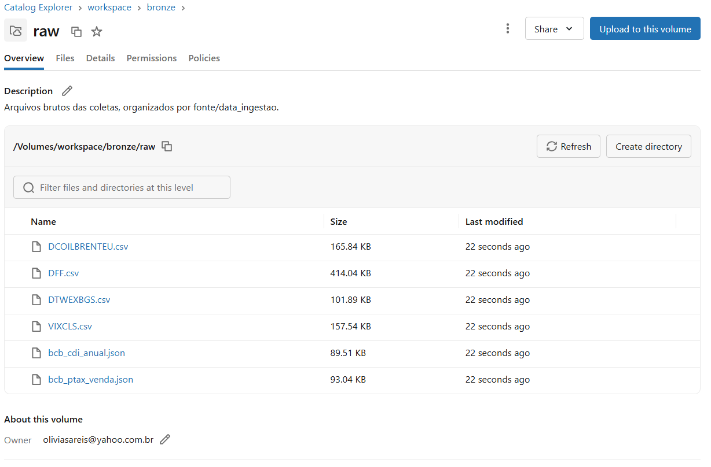

Na sequência, o notebook [`01_bronze_ingestao`](01_bronze_ingestao.py) confere se os 6 arquivos estão no Volume e carrega cada um numa tabela Delta da camada Bronze.

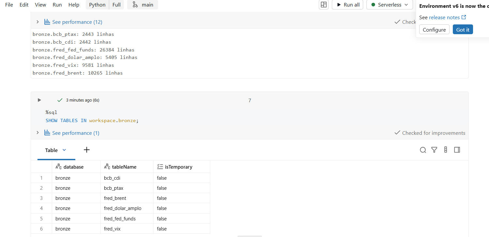

Um detalhe que só percebi aqui: a FRED entrega o **histórico completo** de cada série, e não só o período pedido. O VIX veio desde 1990, o Brent desde 1987 e o Fed Funds desde **1954** (26.384 linhas). Mantive assim na Bronze, que é o dado como veio, e fiz o corte de período na Silver.

---

## 3. Modelagem e Catálogo de Dados (Etapa 4.3)

### Organização em camadas (arquitetura medalhão)

Criei um schema por camada dentro do catálogo `workspace` ([`00_setup`](00_setup.sql)). No Free Edition o catálogo `workspace` já vem pronto, e usar schemas em vez de catálogos separados simplificou permissões sem perder a separação lógica.

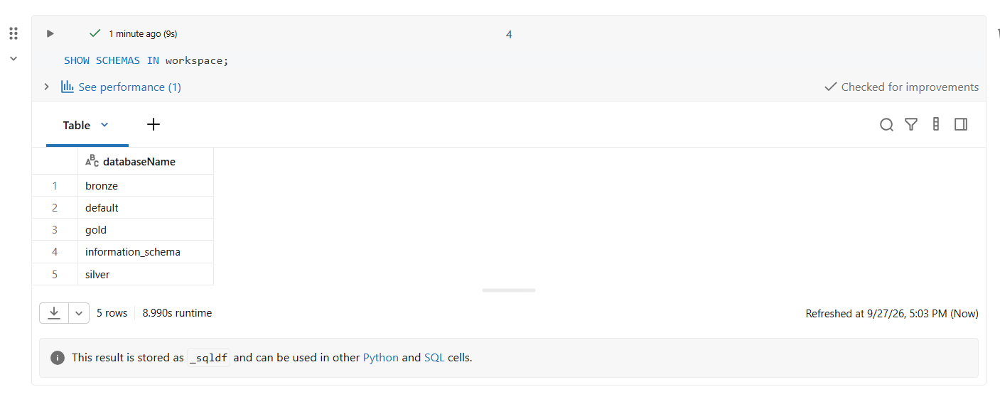

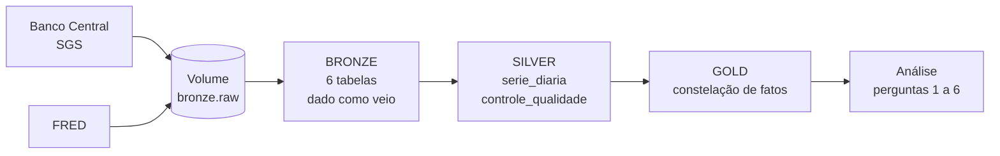

### Modelo da camada Gold: constelação de fatos

A Gold segue o modelo dimensional visto na disciplina de Data Warehouse. Como tenho dois processos com grãos diferentes (o valor de cada indicador por dia, e a "janela" de risco do câmbio por dia útil), usei uma **constelação de fatos** que compartilha a dimensão Tempo.

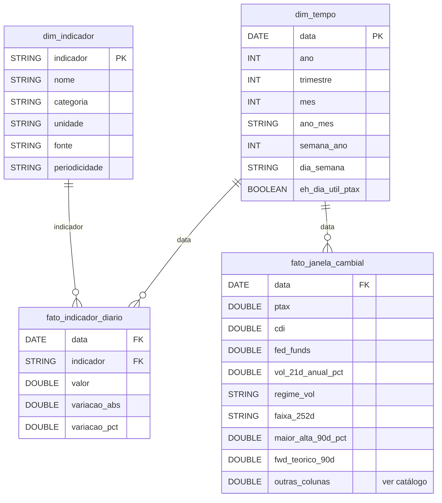

| Tabela | Tipo | Grão (uma linha representa…) |
|---|---|---|
| `dim_tempo` | dimensão | um dia corrido do período |
| `dim_indicador` | dimensão | um indicador (PTAX, CDI, Fed Funds, índice do dólar, VIX, Brent) |
| `fato_indicador_diario` | fato | o valor observado de um indicador em uma data |
| `fato_janela_cambial` | fato | um dia útil com PTAX publicada, com o retrato do mercado naquele dia e o que aconteceu com a PTAX nos 30/60/90 dias seguintes |

**Decisões de modelagem que valem registrar:**

- **Calendário de referência = PTAX.** É a taxa que liquida a exposição, então a `fato_janela_cambial` tem uma linha por dia com PTAX publicada.
- **Alinhamento sem "olhar para o futuro".** Os indicadores têm calendários diferentes (feriados nos EUA, Fed Funds publicado todos os dias, índice do dólar com atraso semanal). Para cada dia de PTAX, uso **o último valor conhecido até aquela data**. Assim a análise nunca usa uma informação que ninguém tinha no momento da decisão.
- **Horizontes de 30/60/90 dias corridos ≈ 21/42/63 dias úteis** de PTAX.
- **Regime de volatilidade** definido pelos terços da distribuição histórica da própria volatilidade de 21 dias: baixa ≤ 10,02% a.a., média ≤ 13,30% a.a., alta > 13,30% a.a.
- **Forward teórico** pela paridade de juros: `PTAX × (1 + CDI)^(du/252) ÷ (1 + FedFunds × dc/360)`. É uma aproximação: não é a cotação real de uma NDF, que inclui cupom cambial, spread do banco e custos.

### Catálogo de Dados

Todas as descrições abaixo também estão gravadas no **Unity Catalog** (via `COMMENT ON TABLE` e `ALTER COLUMN … COMMENT`, nos notebooks 02 e 03), então o catálogo fica junto dos dados e não só neste documento.

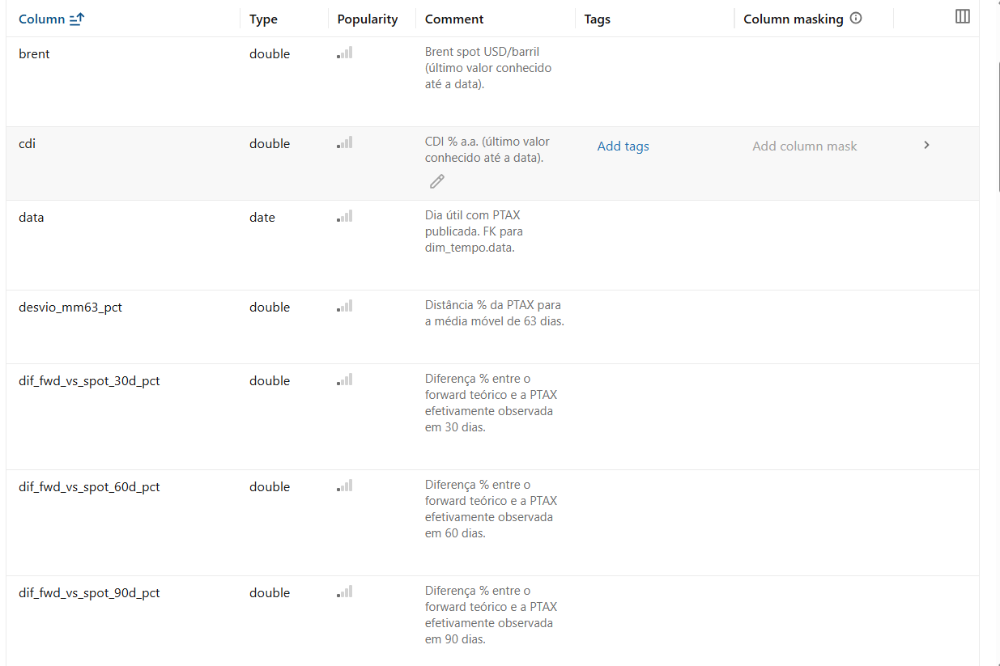

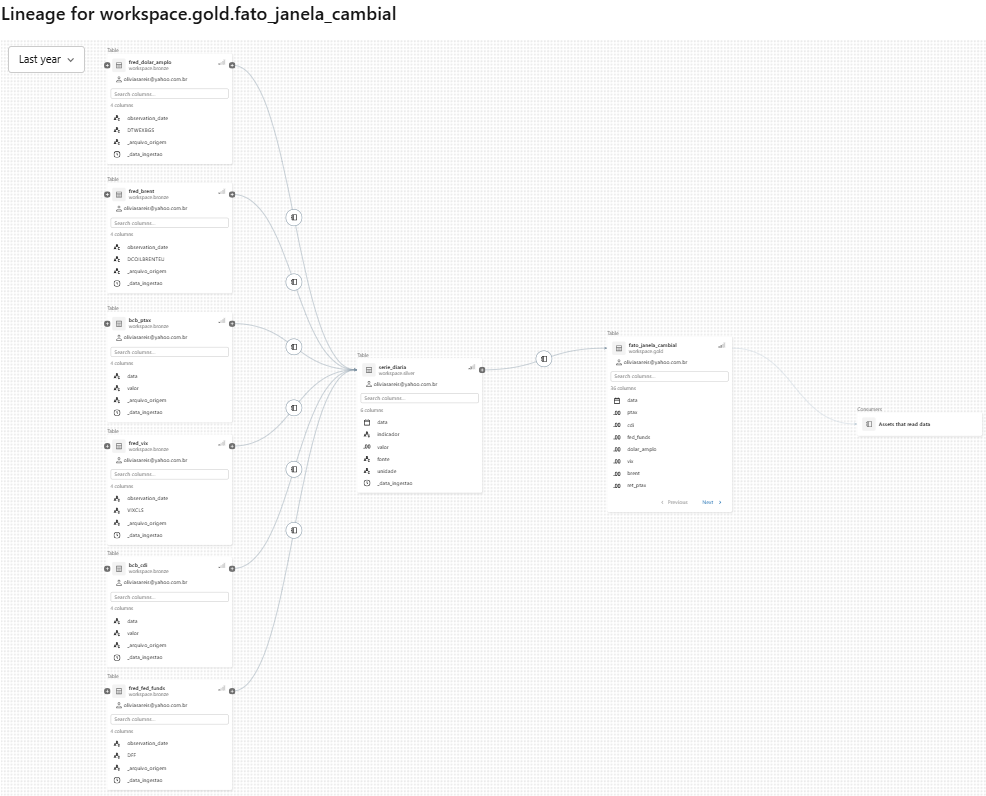

A linhagem acima foi gerada automaticamente pelo Unity Catalog a partir da execução dos notebooks: as 6 tabelas Bronze alimentam a `silver.serie_diaria`, que alimenta a `gold.fato_janela_cambial`, que por sua vez é consumida pelo notebook de análise.

#### Camada Bronze

| Tabela | Conteúdo | Colunas | Linhagem |
|---|---|---|---|
| `bronze.bcb_ptax` | PTAX venda diária, como entregue pelo BCB | `data` (STRING, dd/MM/yyyy), `valor` (STRING) | `raw/bcb_ptax_venda.json` |
| `bronze.bcb_cdi` | CDI anualizado diário, como entregue pelo BCB | `data` (STRING), `valor` (STRING) | `raw/bcb_cdi_anual.json` |
| `bronze.fred_fed_funds` | Fed Funds efetivo desde 1954 | `observation_date` (STRING, yyyy-MM-dd), `DFF` (STRING) | `raw/DFF.csv` |
| `bronze.fred_dolar_amplo` | Índice amplo do dólar desde 2006 | `observation_date`, `DTWEXBGS` (STRING) | `raw/DTWEXBGS.csv` |
| `bronze.fred_vix` | VIX desde 1990 | `observation_date`, `VIXCLS` (STRING) | `raw/VIXCLS.csv` |
| `bronze.fred_brent` | Brent spot desde 1987 | `observation_date`, `DCOILBRENTEU` (STRING) | `raw/DCOILBRENTEU.csv` |

Todas as tabelas Bronze têm também as colunas de controle `_arquivo_origem` (STRING, caminho do arquivo no Volume) e `_data_ingestao` (TIMESTAMP, momento da carga).

#### Camada Silver

**`silver.serie_diaria`**: séries tipadas, deduplicadas e no período do estudo. Grão: data × indicador. Linhagem: todas as tabelas `bronze.*`, empilhadas após tratamento.

| Coluna | Tipo | Descrição | Domínio |
|---|---|---|---|
| `data` | DATE | Data da observação, convertida de dd/MM/yyyy (BCB) ou yyyy-MM-dd (FRED) | 2017-01-01 a 2026-09-25 |
| `indicador` | STRING | Código do indicador | PTAX_VENDA, CDI, FED_FUNDS, DOLAR_AMPLO, VIX, BRENT |
| `valor` | DECIMAL(18,6) | Valor observado na unidade da coluna `unidade` | sempre > 0 |
| `fonte` | STRING | Fonte e código da série | ex.: "Banco Central - SGS 1" |
| `unidade` | STRING | Unidade de medida | BRL por USD; % ao ano; índice; pontos; USD por barril |
| `_data_ingestao` | TIMESTAMP | Momento em que o dado entrou na Bronze | — |

**`silver.controle_qualidade`**: quantas linhas de cada série foram descartadas na passagem Bronze → Silver, e por quê. Colunas: `indicador` (STRING), `linhas_bronze`, `data_invalida`, `fora_periodo`, `sem_valor`, `valor_invalido`, `duplicadas`, `linhas_silver` (BIGINT), `data_execucao` (TIMESTAMP).

#### Camada Gold

**`gold.dim_tempo`**: gerada com `sequence()` entre a primeira e a última data da Silver.

| Coluna | Tipo | Descrição | Domínio |
|---|---|---|---|
| `data` | DATE | Chave da dimensão | dias corridos de 2017-01-01 a 2026-09-25 |
| `ano` | INT | Ano | 2017–2026 |
| `trimestre` | INT | Trimestre | 1–4 |
| `mes` | INT | Mês | 1–12 |
| `ano_mes` | STRING | Ano e mês | yyyy-MM |
| `semana_ano` | INT | Semana ISO | 1–53 |
| `dia_semana` | STRING | Dia da semana em português | domingo a sábado |
| `eh_dia_util_ptax` | BOOLEAN | TRUE se o BCB publicou PTAX no dia (proxy de dia útil no Brasil) | TRUE/FALSE |

**`gold.dim_indicador`**: cadastro dos indicadores, com base na documentação das fontes. Colunas (todas STRING): `indicador` (chave), `nome`, `categoria` (Câmbio, Juros Brasil, Juros EUA, Força global do dólar, Aversão a risco, Commodity), `unidade`, `fonte`, `periodicidade`.

**`gold.fato_indicador_diario`**: linhagem `silver.serie_diaria`.

| Coluna | Tipo | Descrição |
|---|---|---|
| `data` | DATE | FK para `dim_tempo` |
| `indicador` | STRING | FK para `dim_indicador` |
| `valor` | DOUBLE | Valor observado |
| `variacao_abs` | DOUBLE | Diferença para a observação anterior do mesmo indicador |
| `variacao_pct` | DOUBLE | Variação % para a observação anterior do mesmo indicador |

**`gold.fato_janela_cambial`**: linhagem `silver.serie_diaria` (pivotada, alinhada pelo último valor conhecido e enriquecida com métricas de janela).

| Coluna | Tipo | Descrição | Domínio observado |
|---|---|---|---|
| `data` | DATE | Dia útil com PTAX publicada; FK para `dim_tempo` | 2017-01-02 a 2026-09-25 |
| `ptax` | DOUBLE | PTAX venda (BRL por USD) | 3,05 a 6,21 |
| `cdi`, `fed_funds` | DOUBLE | Juros % a.a. (último valor conhecido) | CDI 1,90–14,90; FF 0,04–5,33 |
| `dolar_amplo`, `vix`, `brent` | DOUBLE | Indicadores globais (último valor conhecido) | ver `dim_indicador` para unidades |
| `ret_ptax`, `ret_dolar_amplo`, `ret_vix`, `ret_brent` | DOUBLE | Retorno logarítmico entre dias de PTAX | — |
| `var_ptax_5d_pct` | DOUBLE | Variação % da PTAX em 5 dias úteis | −8,48 a 9,35 |
| `vol_21d_anual_pct` | DOUBLE | Volatilidade realizada da PTAX em 21 dias úteis, anualizada | ≥ 0 |
| `mm_63d`, `desvio_mm63_pct` | DOUBLE | Média móvel de 63 dias úteis e distância % da PTAX para ela | — |
| `min_252d`, `max_252d` | DOUBLE | Mínima e máxima da PTAX nos últimos 252 dias úteis | — |
| `posicao_faixa_252d` | DOUBLE | Posição na faixa do último ano (0 = mínima, 1 = máxima) | 0 a 1 |
| `diferencial_juros_pp` | DOUBLE | CDI − Fed Funds, em p.p. (proxy do carrego) | — |
| `regime_vol` | STRING | Regime de volatilidade | 1-Baixa, 2-Média, 3-Alta |
| `faixa_252d` | STRING | Classificação da posição na faixa | 1-Parte baixa (≤25%), 2-Intermediária, 3-Parte alta (≥75%) |
| `ptax_em_{30,60,90}d` | DOUBLE | PTAX observada 21/42/63 dias úteis depois | nulo no fim da série |
| `var_futura_{30,60,90}d_pct` | DOUBLE | Variação % da PTAX até o horizonte | — |
| `maior_alta_{30,60,90}d_pct` | DOUBLE | Maior alta % da PTAX dentro do horizonte (pior cenário para um pagamento em USD sem proteção) | ≥ 0 |
| `fwd_teorico_{30,60,90}d` | DOUBLE | Forward teórico pela paridade CDI × Fed Funds | — |
| `dif_fwd_vs_spot_{30,60,90}d_pct` | DOUBLE | Diferença % entre o forward teórico e a PTAX observada no horizonte | — |

---

## 4. Pipeline de Dados (Etapa 4.4)

Separei o pipeline em um notebook por etapa. Cada um lê uma camada e grava a seguinte, o que facilitou testar e corrigir uma parte sem rodar tudo de novo.

| Ordem | Notebook | Lê | Grava | O que faz |
|---|---|---|---|---|
| 0 | [`00_setup`](00_setup.sql) | — | schemas `bronze`, `silver`, `gold`; Volume `bronze.raw` | Cria a estrutura |
| 1 | [`01_bronze_ingestao`](01_bronze_ingestao.py) | arquivos do Volume | 6 tabelas `bronze.*` | Confere os arquivos e carrega tudo como texto + metadados de ingestão |
| 2 | [`02_silver`](02_silver.py) | `bronze.*` | `silver.serie_diaria`, `silver.controle_qualidade` | Tipagem, corte de período, remoção de nulos/inválidos/duplicados, empilhamento, contagem de descartes e comentários no catálogo |
| 3 | [`03_gold`](03_gold.py) | `silver.serie_diaria` | `gold.dim_tempo`, `gold.dim_indicador`, `gold.fato_indicador_diario`, `gold.fato_janela_cambial` | Modelo dimensional, alinhamento de calendários, métricas de janela e comentários no catálogo |
| 4 | [`04_qualidade`](04_qualidade.py) | Silver e Gold | — | Verificações de qualidade (seção 5) |
| 5 | [`05_analise`](05_analise.py) | Gold | — | Respostas às perguntas (seção 6) |

Principais transformações e por que foram feitas:

- **Datas em dois formatos → `DATE`.** O BCB usa `dd/MM/yyyy` e a FRED usa `yyyy-MM-dd`. Usei `try_to_date` com o formato de cada fonte; linhas que não convertessem seriam descartadas e contadas (nenhuma foi).
- **Valores em texto → `DECIMAL(18,6)`.** Com `try_cast`, para que células vazias (feriados nos EUA) virassem nulo em vez de quebrar a carga.
- **Formato longo na Silver** (uma linha por data × indicador): permite acrescentar um indicador novo sem mudar a estrutura da tabela.
- **Pivot + alinhamento na Gold:** as séries viram colunas lado a lado, e os indicadores sem valor num dia de PTAX recebem o último valor conhecido (`last(..., ignorenulls=True)` numa janela que só olha para trás).
- **Janelas móveis** (`lag`, `lead`, `stddev`, `avg`, `min`, `max` com `rowsBetween`) para calcular volatilidade, média móvel, faixa de 252 dias e o que aconteceu nos 30/60/90 dias seguintes.

Todas as gravações usam `mode("overwrite")`: rodar o pipeline de novo com os mesmos arquivos produz exatamente o mesmo resultado, sem duplicar linhas.

Um aviso que apareceu no notebook 03 (`No Partition Defined for Window operation`) vale comentar: para calcular médias móveis numa série única, o Spark precisa juntar tudo numa partição. Com cerca de 2.400 linhas isso é irrelevante, mas num volume grande eu particionaria a janela (por exemplo, por moeda, se o modelo tivesse várias).

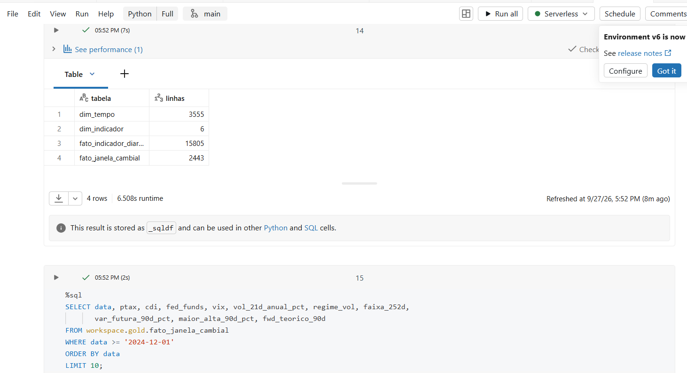

---

## 5. Qualidade de Dados (Etapa 4.5)

Os descartes da Bronze para a Silver ficam registrados em `silver.controle_qualidade`, para que nenhuma linha "suma em silêncio":

| Indicador | Linhas Bronze | Fora do período | Sem valor | Data inválida / valor ≤ 0 / duplicada | Linhas Silver |
|---|---|---|---|---|---|
| BRENT | 10.265 | 7.728 | 71 | 0 | 2.466 |
| CDI | 2.442 | 0 | 0 | 0 | 2.442 |
| DOLAR_AMPLO | 5.405 | 2.870 | 111 | 0 | 2.424 |
| FED_FUNDS | 26.384 | 22.830 | 0 | 0 | 3.554 |
| PTAX_VENDA | 2.443 | 0 | 0 | 0 | 2.443 |
| VIX | 9.581 | 7.044 | 61 | 0 | 2.476 |

- **Fora do período:** a FRED manda o histórico inteiro; mantive só 2017 em diante.
- **Sem valor:** feriados nos EUA, em que a FRED deixa a célula vazia. Foram removidos da Silver e, na Gold, o dia de PTAX correspondente usa o último valor conhecido.
- **O Fed Funds tem mais linhas que a PTAX** (3.554 contra 2.443) porque é publicado em todos os dias corridos, inclusive fins de semana. O alinhamento pelo calendário da PTAX resolve isso.

No notebook [`04_qualidade`](04_qualidade.py) fiz as verificações abaixo:

| Critério | Como verifiquei | Resultado |
|---|---|---|
| **Reconciliação** | Bronze = Silver + descartes; Silver = `fato_indicador_diario`; dias de PTAX = linhas da `fato_janela_cambial` | Diferença **zero** em todas as séries; 2.443 = 2.443 |
| **Completude** | Nulos por coluna na `fato_janela_cambial` | Só nulos **esperados por construção**: 21/42/63 linhas no fim da série (o "futuro" ainda não aconteceu) e poucas no início (primeiro retorno, primeiros 20 dias da volatilidade) |
| **Unicidade** | `COUNT(*) − COUNT(DISTINCT chave)` no grão de cada tabela | **Zero** duplicatas |
| **Consistência** | Anti-join entre fatos e dimensões (o Delta no Free Edition não impõe FK) | **Zero** órfãos |
| **Acurácia** | Valores fora de faixas plausíveis que defini para cada indicador | **Zero** fora da faixa |
| **Lacunas** | Maior intervalo entre observações consecutivas | Máximo de 5 a 6 dias (Carnaval e feriados prolongados) |
| **Defasagem** | Última data de cada série × última PTAX | O índice do dólar está **7 dias atrás** (publicação semanal) |

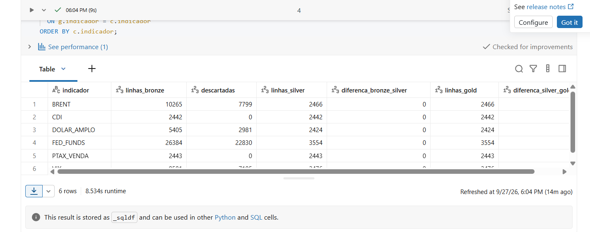

### Outliers: investiguei antes de decidir

Calculei o z-score da variação diária de cada indicador de mercado. Os maiores casos:

| Data | Indicador | Variação | z-score | O que foi |
|---|---|---|---|---|
| 21/04/2020 | Brent | −47,5% (US$ 9,12) | −15,1 | Colapso do petróleo na pandemia |
| 22/04/2020 | Brent | +51,0% | 16,2 | Repique do dia seguinte |
| 05/02/2018 | VIX | +115,6% | 13,5 | "Volmageddon" |
| 18/05/2017 | PTAX | +8,8% | 10,2 | "Joesley Day" (divulgação da delação da JBS) |
| 05/08/2024 | VIX | +64,9% | 7,6 | Desmonte do carry trade em iene |

Todos correspondem a **eventos reais de mercado**, então **mantive os valores**. Eles não são erro de dado: são exatamente os momentos em que uma exposição cambial sem proteção mais sofre, e removê-los distorceria as perguntas 3 e 4.

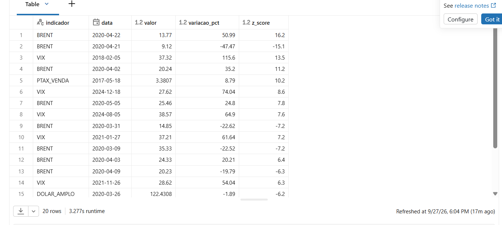

**Limitação conhecida:** como o índice do dólar é publicado com atraso, nos últimos dias da série ele repete o último valor conhecido. Isso afeta só as correlações da última semana.

---

## 6. Análise de Dados (Etapa 4.5)

Antes dos números, dois cuidados de interpretação que valem para toda a seção:

- É uma análise **descritiva do histórico**, não uma previsão.
- As janelas de 30/60/90 dias **se sobrepõem** (cada dia útil abre uma janela nova), então os dias não são observações independentes. Os percentuais mostram frequências históricas, não probabilidades.

### Pergunta 1: como o USD/BRL se comportou?

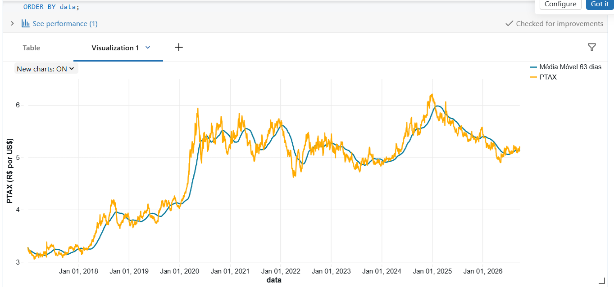

| Ano | PTAX início | PTAX fim | Variação no ano | Vol. média | % dias vol. alta |
|---|---|---|---|---|---|
| 2017 | 3,2729 | 3,3080 | +1,07% | 10,96% | 8,4% |
| 2018 | 3,2697 | 3,8748 | +18,51% | 12,85% | 43,6% |
| 2019 | 3,8595 | 4,0307 | +4,44% | 11,02% | 14,6% |
| 2020 | 4,0213 | 5,1967 | **+29,23%** | **18,69%** | **73,7%** |
| 2021 | 5,1626 | 5,5805 | +8,09% | 14,28% | 55,4% |
| 2022 | 5,6309 | 5,2177 | −7,34% | 15,48% | 73,3% |
| 2023 | 5,3436 | 4,8413 | −9,40% | 11,79% | 19,7% |
| 2024 | 4,8916 | 6,1923 | **+26,59%** | 10,64% | 17,8% |
| 2025 | 6,2086 | 5,5024 | −11,37% | 10,06% | 13,1% |
| 2026 (até 25/09) | 5,4372 | 5,1991 | −4,38% | 9,58% | 7,1% |

2020 foi o ano extremo: a maior alta e a maior volatilidade do período, com três em cada quatro dias em regime de volatilidade alta. Já 2026, até setembro, é o ano mais calmo da série (vol. média de 9,6% e só 7% dos dias em vol. alta). O que me chamou atenção foi **2024**: o dólar subiu quase o mesmo que em 2020 (+26,6%), mas com volatilidade média **baixa** (10,6%). Foi uma alta "em escada", sem pânico diário. Isso já antecipa o que aparece na pergunta 3.

Numa semana típica o dólar anda **1,48%** (em módulo). Em 90% das semanas ele ficou entre **−2,97% e +3,31%**, e a cauda de alta é maior que a de queda (+9,35% contra −8,48% nos extremos). Para quem tem pagamento em dólar, a assimetria joga contra.

### Pergunta 2: o que se move junto com o dólar?

Correlação da variação semanal da PTAX com a variação semanal de cada indicador:

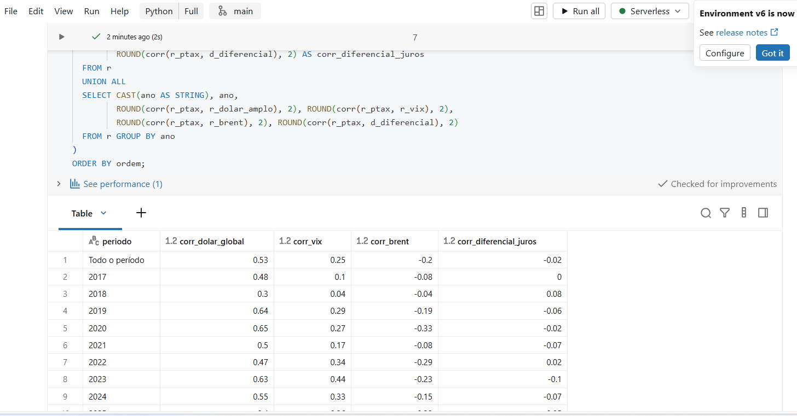

| | Dólar global | VIX | Brent | Diferencial de juros |
|---|---|---|---|---|
| **2017–2026** | **0,53** | 0,25 | −0,20 | −0,02 |
| Faixa anual | 0,30 a 0,65 | 0,04 a 0,44 | −0,04 a −0,33 | −0,10 a 0,08 |

- **O dólar global é o fator mais forte e mais estável.** Em todos os anos a correlação ficou entre 0,30 e 0,65. Boa parte do movimento do real vem do dólar se fortalecendo ou enfraquecendo no mundo, e não de fatores só locais.
- **O VIX ganhou peso nos últimos anos** (de 0,04–0,10 em 2017–2018 para 0,33–0,44 em 2022–2024). Aversão a risco global passou a pesar mais sobre o real.
- **O Brent tem relação negativa**, coerente com o Brasil como exportador de commodities: petróleo sobe, real tende a se fortalecer.
- **O diferencial de juros praticamente não explica o movimento semanal.** Faz sentido: juros mudam devagar, e o efeito do carrego aparece no custo da proteção (pergunta 5), não no movimento de curto prazo.

Correlação não é causalidade: esses números mostram o que andou junto, não o que causou o quê.

### Pergunta 3: quanta imprevisibilidade uma exposição sem proteção carregou?

Para cada dia, calculei a **maior alta da PTAX nos 30/60/90 dias seguintes**: o pior momento para quem tinha que pagar em dólar e não estava protegido.

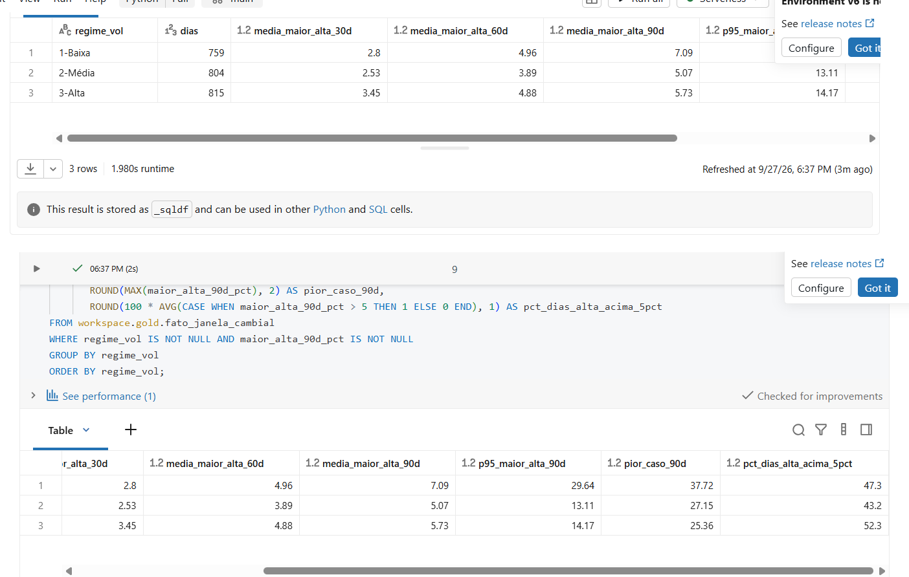

| Regime de vol. | Dias | Maior alta média 30d | 60d | 90d | P95 90d | Pior caso 90d | % dias com alta > 5% em 90d |
|---|---|---|---|---|---|---|---|
| 1-Baixa | 759 | 2,80% | 4,96% | **7,09%** | **29,64%** | **37,72%** | 47,3% |
| 2-Média | 804 | 2,53% | 3,89% | 5,07% | 13,11% | 27,15% | 43,2% |
| 3-Alta | 815 | **3,45%** | 4,88% | 5,73% | 14,17% | 25,36% | **52,3%** |

Esse foi o resultado que mais me surpreendeu. No curto prazo (30 dias), o regime de volatilidade alta é o mais arriscado, como eu esperava. **Mas em 90 dias, foi a volatilidade baixa que antecedeu as maiores altas**: média de 7,1%, cauda de 29,6% e o pior caso do período inteiro (37,7%).

A leitura que faço: **calmaria não é sinônimo de baixo risco**. Os momentos calmos antecederam choques. O exemplo mais claro é o início de 2020, que estava tranquilo até a pandemia. Para a tesouraria, isso é um argumento contra esperar o "momento perfeito" quando o mercado parece calmo.

### Pergunta 4: a posição do dólar na faixa do último ano diz algo sobre os 90 dias seguintes?

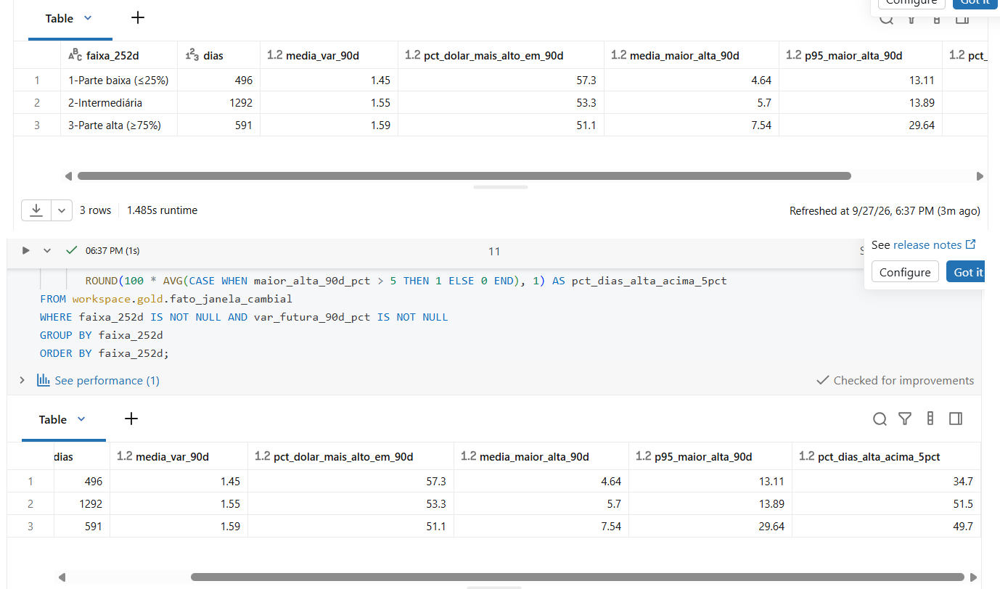

| Faixa do último ano | Dias | Var. média 90d | % vezes dólar mais alto em 90d | Maior alta média 90d | P95 maior alta 90d | % dias com alta > 5% |
|---|---|---|---|---|---|---|
| 1-Parte baixa (≤25%) | 496 | +1,45% | **57,3%** | 4,64% | 13,11% | 34,7% |
| 2-Intermediária | 1.292 | +1,55% | 53,3% | 5,70% | 13,89% | 51,5% |
| 3-Parte alta (≥75%) | 591 | +1,59% | 51,1% | **7,54%** | **29,64%** | 49,7% |

Cruzando faixa e regime (maior alta média em 90 dias; número de dias entre parênteses):

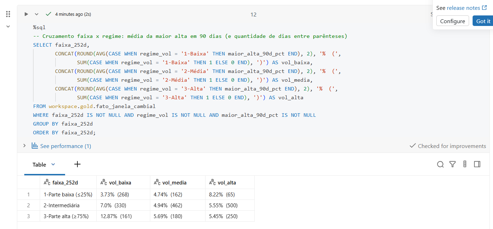

| Faixa | Vol. baixa | Vol. média | Vol. alta |
|---|---|---|---|
| 1-Parte baixa | 3,73% (268) | 4,74% (162) | 8,22% (65) |
| 2-Intermediária | 7,00% (330) | 4,94% (462) | 5,55% (500) |
| 3-Parte alta | **12,87% (161)** | 5,69% (180) | 5,45% (250) |

O que encontrei:

- **Dólar na parte baixa da faixa** esteve mais alto 90 dias depois em 57% das vezes, contra 51% quando estava na parte alta. Existe um sinal, mas ele é fraco: a variação média em 90 dias é quase igual nas três faixas (~1,5%).
- **O risco de cauda é maior com o dólar já na parte alta**, e principalmente na combinação **parte alta + volatilidade baixa** (12,9% de alta média em 90 dias). Esse grupo tem poucos dias (161) e é bem concentrado no pré-pandemia, então trato como um sinal que merece atenção, não como regra.
- **Dólar na parte baixa com volatilidade baixa** foi a combinação mais tranquila (3,7%). Se existe uma "janela de oportunidade" no histórico, é essa: proteger quando o dólar está perto da mínima do ano e o mercado está calmo.

**Retrato da última data disponível (25/09/2026)**, apenas como ilustração de uso da base, não como recomendação:

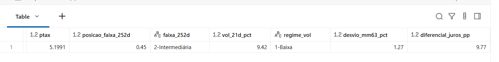

| PTAX | Posição na faixa | Faixa | Vol. 21d | Regime | Desvio da MM63 | Diferencial de juros |
|---|---|---|---|---|---|---|
| 5,1991 | 0,45 | Intermediária | 9,42% | Baixa | +1,27% | 9,77 p.p. |

Historicamente, a combinação **intermediária + vol. baixa** teve maior alta média de **7,0% em 90 dias** (330 dias de amostra).

### Pergunta 5: quanto custava a previsibilidade?

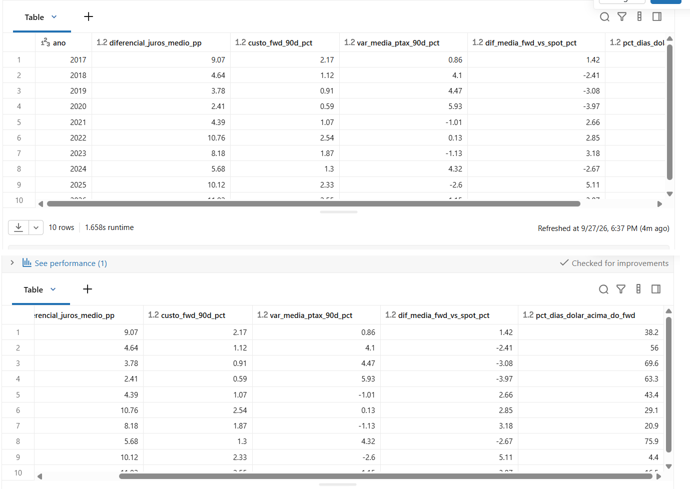

| Ano | Diferencial de juros médio | Custo do forward 90d | Var. média da PTAX em 90d | Forward − spot realizado | % dias em que o dólar superou o forward |
|---|---|---|---|---|---|
| 2017 | 9,07 p.p. | 2,17% | +0,86% | +1,42% | 38,2% |
| 2018 | 4,64 p.p. | 1,12% | +4,10% | −2,41% | 56,0% |
| 2019 | 3,78 p.p. | 0,91% | +4,47% | −3,08% | 69,6% |
| 2020 | 2,41 p.p. | **0,59%** | +5,93% | −3,97% | 63,3% |
| 2021 | 4,39 p.p. | 1,07% | −1,01% | +2,66% | 43,4% |
| 2022 | 10,76 p.p. | **2,54%** | +0,13% | +2,85% | 29,1% |
| 2023 | 8,18 p.p. | 1,87% | −1,13% | +3,18% | 20,9% |
| 2024 | 5,68 p.p. | 1,30% | +4,32% | −2,67% | 75,9% |
| 2025 | 10,12 p.p. | 2,33% | −2,60% | +5,11% | 4,4% |
| 2026* | 11,02 p.p. | **2,55%** | −1,15% | +3,87% | 16,5% |

\* Em 2026 só entram as datas que já têm 90 dias de "futuro" observado (até meados do ano).

- **O custo de travar o câmbio por 90 dias acompanha o diferencial de juros.** Foi de 0,6% em 2020 (Selic na mínima) a cerca de 2,5% em 2022 e em 2025–2026. **Hoje a previsibilidade está entre as mais caras do período.**
- **Nos anos de alta do dólar (2018–2020 e 2024), o dólar subiu mais do que o forward embutia** (diferença negativa): a proteção absorveu essa alta e o fluxo de caixa ficou previsível.
- **Nos anos de queda (2021–2023, 2025 e o que já se observou de 2026), o forward ficou acima do spot realizado**: esse foi o preço pago pela previsibilidade. Em 2025, o dólar superou o forward em só 4,4% dos dias.

Isso reforça que a proteção não deve ser julgada pelo resultado de um ano isolado: ela cumpre sua função justamente nos anos em que não se sabia qual dos dois cenários ia acontecer.

### Pergunta 6: NDF ou call? (resposta parcial)

Não existe dado público gratuito de volatilidade implícita nem de prêmio de opção de dólar. Então **estimei** o prêmio de uma call de 90 dias com strike no forward pela fórmula de **Garman-Kohlhagen** (o Black-Scholes para moedas), usando a **volatilidade realizada de 21 dias como proxy da implícita**.

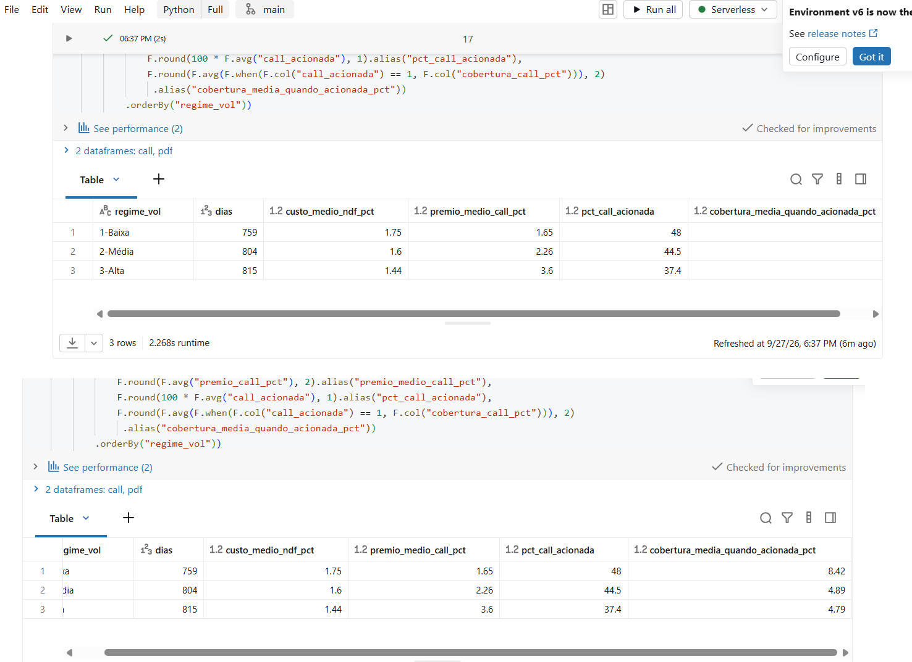

| Regime | Dias | Custo médio da NDF (fwd − spot) | Prêmio médio da call | % vezes que a call seria acionada | Cobertura média quando acionada |
|---|---|---|---|---|---|
| 1-Baixa | 759 | 1,75% | **1,65%** | 48,0% | **8,42%** |
| 2-Média | 804 | 1,60% | 2,26% | 44,5% | 4,89% |
| 3-Alta | 815 | 1,44% | **3,60%** | 37,4% | 4,79% |

- **Em volatilidade baixa, a call teórica custa praticamente o mesmo que o carrego da NDF**, e quando foi acionada cobriu em média 8,4% de alta. Somando com a pergunta 3 (vol baixa antecedeu as maiores altas em 90 dias), a opção parece mais interessante justamente nesse regime, porque protege e ainda preserva o benefício se o dólar cair.
- **Em volatilidade alta, a call fica 2,5 vezes mais cara que o carrego da NDF**, e a NDF tende a ser mais eficiente.

**Premissas e riscos desta estimativa:**
- A volatilidade implícita do real raramente fica tão baixa quanto a realizada. O prêmio estimado está **mais subestimado justamente no regime de vol. baixa**, então a vantagem da call nesse regime é provavelmente menor do que a tabela mostra.
- Não há smile de volatilidade, spread do banco, IOF nem custos operacionais.
- Os custos não são da mesma natureza: o prêmio da call é pago à vista e é perdido se o dólar cair; o custo da NDF está embutido na taxa travada.
- **NDF com cap não foi analisada:** a estrutura depende de termos negociados com o banco (nível do cap, prêmio embutido), e simular sem esses dados seria inventar premissa.

### Discussão geral

Juntando as respostas, a principal conclusão é que **o histórico não aponta um "momento certo" claro para proteger, mas mostra quando esperar é mais perigoso**. A posição do dólar na faixa do ano traz um sinal fraco; a volatilidade baixa, que costuma passar sensação de segurança, antecedeu as maiores altas em 90 dias; e o custo de travar o câmbio depende muito mais do diferencial de juros do que de acertar a direção do dólar.

Para a decisão de hedge, isso sugere três coisas: (1) ter uma política de proteção que não dependa de "esperar a hora", (2) olhar o regime de volatilidade na hora de escolher o instrumento, já que opções ficam relativamente baratas justamente quando o risco em 90 dias é maior, e (3) aceitar que, com juros altos como hoje, a previsibilidade custa mais e isso precisa estar no orçamento.

---

## 7. Autoavaliação

### O que consegui atingir

Consegui construir o pipeline completo proposto: dados brutos de fontes oficiais na nuvem, arquitetura medalhão com Bronze, Silver e Gold, um modelo dimensional em constelação, catálogo documentado dentro do Unity Catalog e uma verificação de qualidade com reconciliação que fechou em zero.

Das seis perguntas, **as perguntas 1 a 5 foram respondidas** com dados. A **pergunta 6 foi respondida em parte**: a comparação entre NDF e call depende de uma estimativa de prêmio com premissas fortes, e a NDF com cap ficou de fora por falta de dados públicos.

### Dificuldades

- **Bloqueio de internet no Free Edition.** A ideia original era coletar tudo por API dentro do notebook. Descobri o bloqueio só ao rodar, e precisei mudar a estratégia de coleta no meio do caminho. No fim, o download manual pelas URLs oficiais ficou até mais rastreável.
- **Calendários diferentes.** Não tinha pensado antes em quanto isso importaria: Fed Funds publicado em fim de semana, índice do dólar com uma semana de atraso, feriados diferentes no Brasil e nos EUA. Resolver isso sem "olhar para o futuro" foi a decisão técnica mais importante da Gold.
- **Histórico longo da FRED.** Esperava receber só o período pedido. Isso gerou milhares de linhas "fora do período", que acabaram virando um bom caso para o controle de descartes.
- **Interpretar os resultados sem exagerar.** A combinação "parte alta + vol. baixa" deu um número muito chamativo (12,9%), mas com amostra pequena e concentrada em um episódio. Aprendi a olhar o número de dias antes de tirar conclusão.

### Limitações que reconheço

- As janelas de 90 dias se sobrepõem, então as frequências não são probabilidades independentes.
- O forward é teórico (paridade de juros), não a cotação real de NDF.
- A volatilidade realizada foi usada como proxy da implícita.
- O índice amplo do dólar não é o DXY, e o EEM ficou de fora.
- O pipeline roda manualmente, com carga completa (overwrite), e não de forma agendada nem incremental.

### Trabalhos futuros

- **Automatizar a coleta** por API num ambiente com saída para a internet, com um Job agendado no Databricks rodando os notebooks em sequência, e trocar a carga completa por **carga incremental com `MERGE`**.
- **Incluir expectativas de mercado**, como o boletim Focus do Banco Central (câmbio e Selic esperados), para comparar o forward com o que o mercado projetava.
- **Incluir volatilidade implícita e prêmios reais** de opções de dólar (B3), para refazer a pergunta 6 sem proxy.
- **Simular NDF com cap** a partir de termos reais de mercado.
- **Acrescentar o EEM e o CDS Brasil** como medidas de risco de emergentes e de risco-país.
- **Fechar o ciclo com o MVP anterior:** usar a `fato_janela_cambial` como base do modelo de machine learning, agora com dados organizados, versionados e documentados.
- **Publicar um painel** (Databricks AI/BI ou Power BI) sobre a Gold, com o "retrato do dia" atualizado automaticamente.
